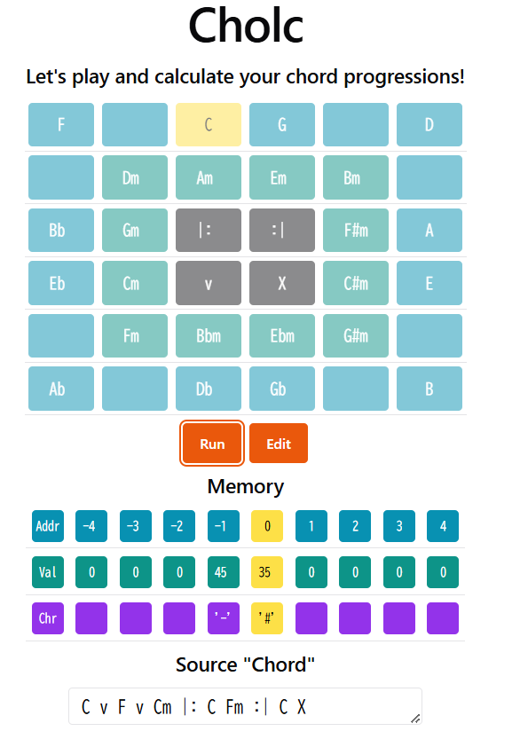
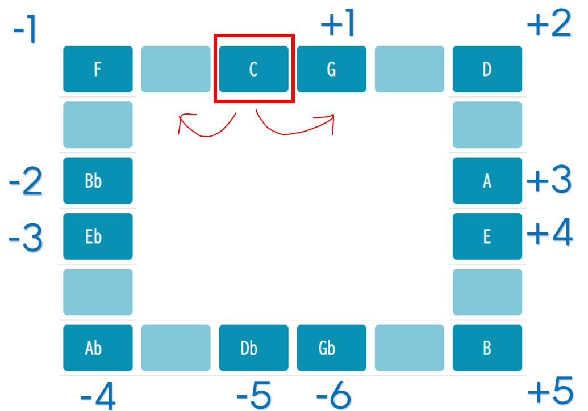

# cholc
A musical programming language: let's play and calculate your chord progressions!

# about

Cholc is an esoteric programming language made up of sequences of musical chords.
In the playground, you can execute the source "chords" with their sweet sound!



(TODO: sample code here)

# language specification
## operators

The operators in Cholc are quite similar to brainf\*ck. You can move a pointer, and increment/decrement its value.

|operator|role|
|-|-|
|`{major chord}`|increment the value referred by the pointer|
|`{minor chord}`|decrement the value referred by the pointer|
|`\|:`|jump right after to the corresponding `:\|` if the value referred by the pointer is `0`|
|`:\|`|jump right after to the corresponding `\|:` if the value referred by the pointer is not `0`|
|`v`|read 1 byte from an input and write to the pointer|
|`X`|write the value referred by the pointer to an output|

Only triad major/minor chords can be used as operators (sorry jazz fans!).
An alphabet `b` is used as a flat symbol. Here is an example of chord operations.

```
C
Cm
F#
Bbm
// Any enharmonic equivalents can be used
A#m
```

## moving the pointer
You may find that the pointer operator is missing in the table.
Moving pointer in Cholc is a little tricky and based on music theory.

The movement of the pointer depends on the interval between the two chords in a row.

|progression|interval|example|pointer movement|
|-|-|-|-|
|weak progression|7 semitones (perfect 5th)|`C G`|`1`|
|strong progression|5 semitones (perfect 4th)|`G C`|`-1`|

Any pair of chords moves the pointer and its movement is "how many times to add perfect fifth".
The chord buttons in the playground (which are allocated as "circle of fifths") will help you.



Here are the rules of the movement.

- major/minor does not affect to the pointer movement
- if `movement > 5`, subtract `12` (treated as negative movement)

Example:

|chords|pointer movement|
|-|-|
|`C C`|`0`|
|`C G`|`+1`|
|`C D`|`+2`|
|`C B`|`+5`|
|`C Gb`|`-6`|
|`C F`|`-1`|
|`F Bb`|`-1`|
|`F G`|`+2`|
|`C Fm`|`-1`|
|`C Cm`|`0`|

## order of pointer movement

The pointer movement occurs between two chord operations.

For example, `C G` is evaluated in this order.

0. At first, all memory is filled with `0` and the pointer refers address `0`

|address|0|1|
|:-:|:-:|:-:|
|pointer|here||
|value|0|0|

1. chord `C` is evaluated and the value is incremented

|address|0|1|
|:-:|:-:|:-:|
|pointer|here||
|value|1|0|

2. chord progression `C G` is evaluated and the pointer is moved to address `1`

|address|0|1|
|:-:|:-:|:-:|
|pointer||here|
|value|1|0|

3. chord `G` is evaluated and the value is incremented

|address|0|1|
|:-:|:-:|:-:|
|pointer||here|
|value|1|1|
